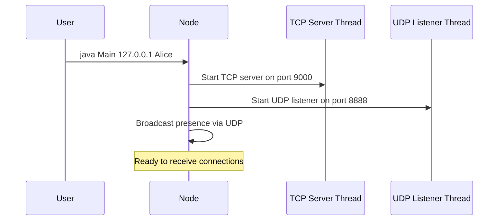
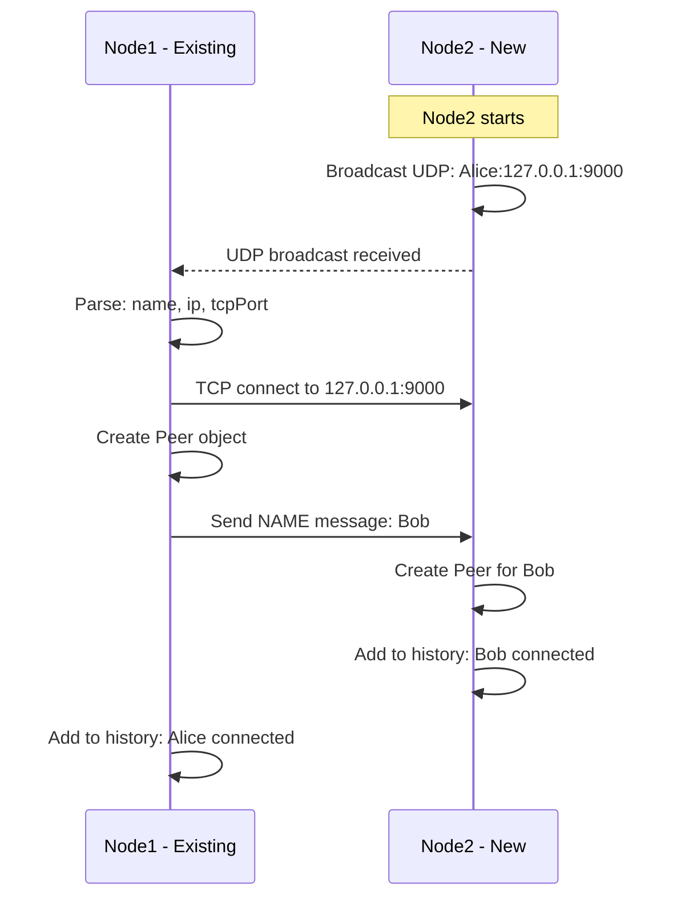
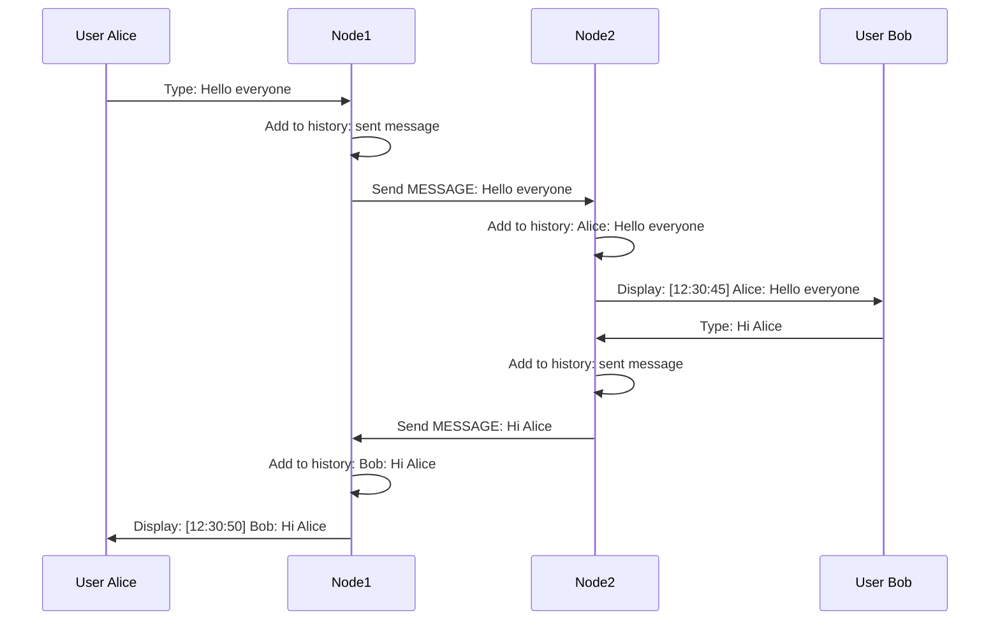
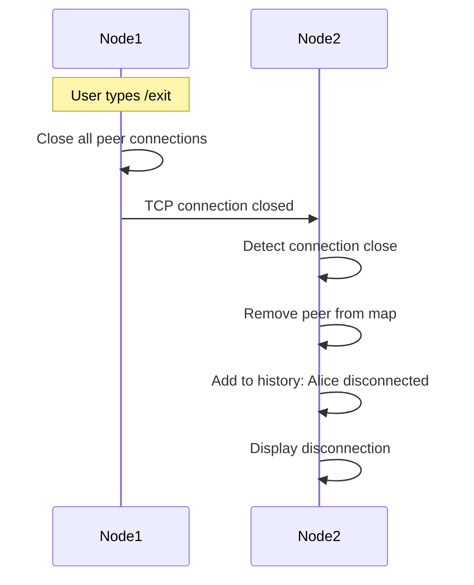
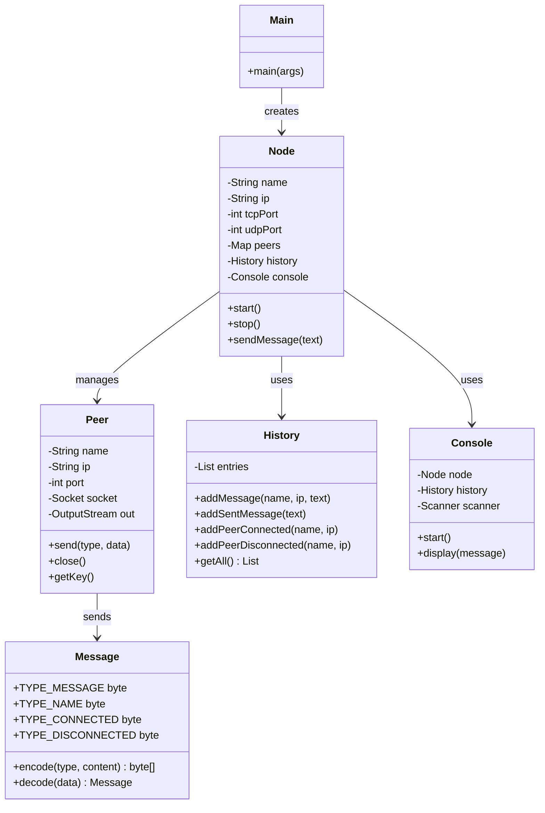

# Simplified P2P Chat Architecture Plan

## Overview

This document describes a **simplified** architecture for a console-based P2P chat application in Java. The goal is to minimize the number of classes while maintaining all required functionality.

## Current vs Simplified Architecture

| Current (10 classes) | Simplified (5 classes) |
|---------------------|------------------------|
| Type.java | (use byte constants) |
| Message.java | Message.java |
| History.java | History.java |
| PeerInfo.java | Peer.java |
| PeerNode.java | Node.java |
| TcpServer.java | (merged into Node.java) |
| UdpBroadcastListener.java | (merged into Node.java) |
| PeerConnectionHandler.java | (merged into Node.java) |
| Log.java | Console.java |
| Main.java | Main.java |

## Simplified Class Design

### 1. Main.java - Entry Point

**Responsibility:** Parse command line arguments and start the node.

```
+-------------------+
|      Main         |
+-------------------+
| - args: String[]  |
+-------------------+
| + main(args)      |
| - parseArgs(args) |
+-------------------+
```

**Command line parameters:**
- `args[0]` - IP address to bind to (e.g., 127.0.0.1)
- `args[1]` - Username (e.g., Alice)

### 2. Node.java - Main Peer Logic

**Responsibility:** 
- Start TCP server and UDP listener threads
- Handle peer discovery via UDP broadcast
- Manage TCP connections to peers
- Send/receive messages
- Handle graceful disconnection

```
+-------------------------------+
|           Node                |
+-------------------------------+
| - name: String                |
| - ip: String                  |
| - tcpPort: int                |
| - udpPort: int                |
| - peers: Map<String, Peer>    |
| - history: History            |
| - console: Console            |
| - running: boolean            |
+-------------------------------+
| + start()                     |
| + stop()                      |
| + sendMessage(text)           |
| - broadcastPresence()         |
| - connectToPeer(ip, port)     |
| - handleIncomingMessage(msg)  |
| - handleDisconnect(peer)      |
| - startTcpServer()            |
| - startUdpListener()          |
+-------------------------------+
```

### 3. Peer.java - Peer Connection

**Responsibility:** 
- Hold peer connection data (name, IP, socket, output stream)
- Provide methods to send messages via binary protocol

```
+-------------------------------+
|           Peer                |
+-------------------------------+
| - name: String                |
| - ip: String                  |
| - port: int                   |
| - socket: Socket              |
| - out: OutputStream           |
+-------------------------------+
| + Peer(socket)                |
| + send(type, data)            |
| + close()                     |
| + getKey()                    |
+-------------------------------+
```

### 4. Message.java - Binary Protocol

**Responsibility:** 
- Encode/decode messages in binary format
- Support message types: NAME(2), MESSAGE(1), CONNECTED(3), DISCONNECTED(4)

**Binary format:**
```
Offset 0: Message type (1=message, 2=name, 3=connected, 4=disconnected)
Offset 1: Message length (n bytes)
Offset 2..n+1: Message content (UTF-8 encoded)
```

```
+-------------------------------+
|          Message              |
+-------------------------------+
| + TYPE_MESSAGE: byte = 1      |
| + TYPE_NAME: byte = 2         |
| + TYPE_CONNECTED: byte = 3    |
| + TYPE_DISCONNECTED: byte = 4 |
+-------------------------------+
| + encode(type, content): byte[]|
| + decode(data): Message       |
| + getType(): byte             |
| + getContent(): String        |
+-------------------------------+
```

### 5. History.java - Event Log

**Responsibility:** 
- Store events chronologically with timestamps
- Events: incoming messages, sent messages, peer discovery, peer disconnection

```
+-------------------------------+
|          History              |
+-------------------------------+
| - entries: List<Entry>        |
+-------------------------------+
| + addMessage(name, ip, text)  |
| + addSentMessage(text)        |
| + addPeerConnected(name, ip)  |
| + addPeerDisconnected(name, ip)|
| + getAll(): List<String>      |
+-------------------------------+
```

### 6. Console.java - User Interface

**Responsibility:** 
- Read keyboard input
- Display event history
- Handle /exit command

```
+-------------------------------+
|          Console              |
+-------------------------------+
| - node: Node                  |
| - history: History            |
| - scanner: Scanner            |
+-------------------------------+
| + start()                     |
| + display(message)            |
| - readInput()                 |
+-------------------------------+
```

## Message Flow Diagrams

### 1. Startup Flow



### 2. Peer Discovery Flow



### 3. Messaging Flow



### 4. Disconnect Flow



## Class Diagram



## Project Structure

```
KSIS-3LR/
├── src/
│   └── P2Pchat/
│       ├── Main.java           - Entry point, arg parsing
│       ├── Node.java           - Main peer logic, TCP/UDP handling
│       ├── Peer.java           - Peer connection wrapper
│       ├── Message.java        - Binary message encoding/decoding
│       ├── History.java        - Event history with timestamps
│       └── Console.java        - Console UI, input handling
├── plans/
│   └── p2p-chat-plan.md
└── README.md
```

## Testing

To test with multiple instances on the same machine using loopback addresses:

```bash
# Terminal 1 - Alice
java -cp out P2Pchat.Main 127.0.0.1 Alice

# Terminal 2 - Bob  
java -cp out P2Pchat.Main 127.0.0.2 Bob

# Terminal 3 - Charlie
java -cp out P2Pchat.Main 127.0.0.3 Charlie
```

## Implementation Notes

### Binary Protocol Details

**Message Encoding:**
```java
// Example: Encoding a text message
byte[] data = new byte[2 + content.getBytes().length];
data[0] = TYPE_MESSAGE;           // 1
data[1] = content.length;         // message length
System.arraycopy(content.getBytes(), 0, data, 2, content.length);
```

**Message Decoding:**
```java
// Example: Decoding a message
byte type = data[0];
int length = data[1];
String content = new String(data, 2, length);
```

### Thread Model

1. **Main Thread** - Console input loop
2. **TCP Server Thread** - Accepts incoming connections
3. **UDP Listener Thread** - Receives discovery broadcasts
4. **Per-Peer Thread** - Reads incoming messages from each connected peer

### Connection Deduplication

Use `ip:port` as unique key to prevent duplicate connections:
- Check if peer already exists before connecting
- Handle race condition when both nodes try to connect simultaneously

### History Format

```
[HH:mm:ss] Alice (127.0.0.1): Hello everyone
[HH:mm:ss] >>> Hello everyone
[HH:mm:ss] Bob (127.0.0.2) connected
[HH:mm:ss] Bob (127.0.0.2) disconnected
```

## Summary of Simplifications

1. **Removed Type.java** - Use byte constants in Message.java
2. **Merged TcpServer.java, UdpBroadcastListener.java, PeerConnectionHandler.java into Node.java** - All network handling in one class
3. **Renamed Log.java to Console.java** - Clearer naming
4. **Renamed PeerInfo.java to Peer.java** - Simpler naming
5. **Removed history transfer feature** - Not required for basic functionality
6. **Simplified command line args** - Only IP and name required (ports can be fixed)

**Result: 5 classes instead of 10, with clearer responsibilities and simpler interactions.**
